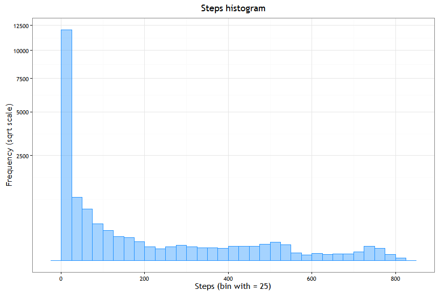
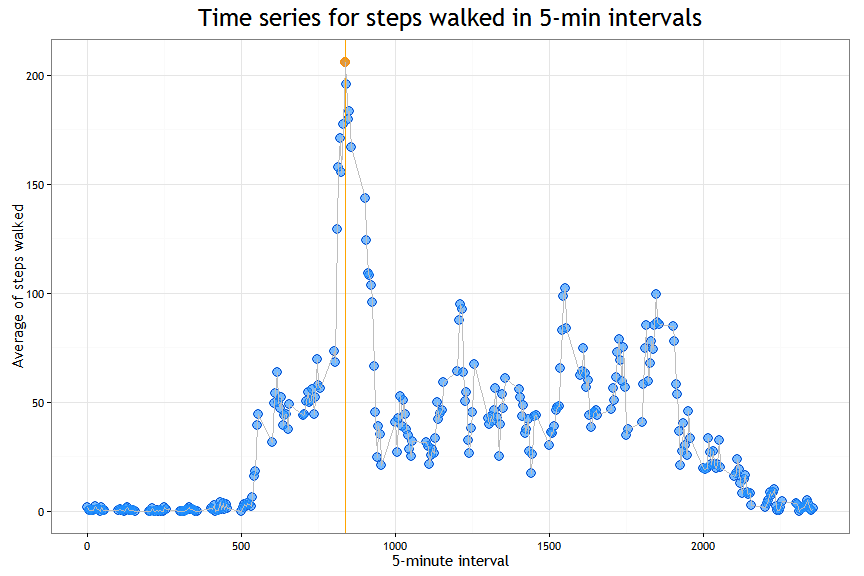
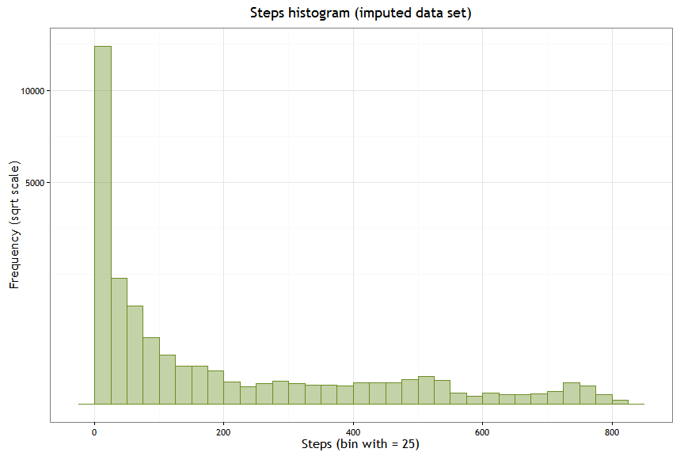
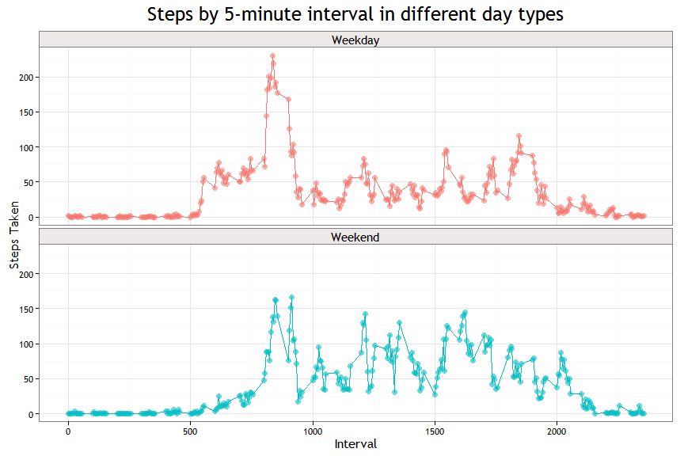

Reproducible Research Peer Assessment 1
=======================================  


####**QUESTION 1: Loading and preprocessing the data**  
1. Get the data from the file in the right format and convert the 'date' field to date type  
2. Show the main facts about the raw data for exploration  

*Read the csv file and evaluate a summary to check the data*

```r
setwd("C:/Users/xgs/Desktop/Coursera_Data _Science/5-Reproducible Research/Week 2")
Activity <- read.csv(paste(getwd(),"/Assignment/activity.csv", sep=""), header = TRUE
                , sep = "," , colClasses = c("numeric","Date","numeric"))
names(Activity) <- c("Steps","Date","Interval")
```

####**QUESTION 2: What is mean total number of steps taken per day?**  
1. Make a histogram of the total number of steps taken each day (ignoring NAs)
2. Calculate and report the mean and median toatl number of steps taken per day  

*Procedure: Complete cases to get rid of NA values. Evaluation of mean and median for steps taken by day (that means, calculating the totals for each day and obtaining the mean and median). Finally plot the histogram*  

*Note: Because it seems that the few-steps values have frequencies much more higher than the rest, is difficult to see any interesting feature in this chart. To get more information let's change the* **Y scale to an square root of counts.** *Doing so we can appreciate more detail*


```r
##      Remove NA
ActivityClean <- Activity[complete.cases(Activity) == TRUE,]

##      Aggregate steps by Date and format of the new dataset
ActivityCleanByDay <- aggregate(Steps ~ Date, data = Activity, FUN = mean)
##      Evaluation of mean and median from the total steps by day
meanActivityCleanByDay <- mean(ActivityCleanByDay$Steps)
medianActivityCleanByDay <- median(ActivityCleanByDay$Steps)

##      Loads fonts and prepares aesthetics of the ggplot histogram
windowsFonts(A=windowsFont("Trebuchet MS"))
gObj <- ggplot(ActivityClean, aes(x = Steps))
gObj <- gObj + geom_histogram(colour = "dodgerblue", fill = "dodgerblue"
                , binwidth = 25, font_family = "A", alpha = 0.4)
gObj <- gObj + theme_bw(base_family = "A", base_size = 14)
gObj <- gObj + scale_y_sqrt()
gObj <- gObj + xlab("Steps (bin with = 25)")
gObj <- gObj + ylab("Frequency (sqrt scale)")
gObj <- gObj + ggtitle("Steps histogram")
gObj <- gObj + theme(axis.title = element_text(family = "A", size = 16)
                , title = element_text(family = "A", size = 15)
                , plot.title = element_text(vjust = 2))
print(gObj)
```

 


*The mean and median total number of steps taken per day, once NA have been removed, are:*

* **Median:** 37.383
* **Mean:** 37.378

####**QUESTION 3: What is the average daily activity pattern**  
1. Make a time series plot of the 5-minute interval (x-axis) and the average number of steps taken, averaged across all days (y-axis)
2. Which 5-minute interval, on average across all the days in the dataset, contains the maximum number of steps?  

*Procedure: aggregate Steps by Interval, determine the maximum value in the array and plot the data*


```r
##      Aggregate steps by Interval and format of the new dataset
ActivityCleanByStep <- aggregate(Steps ~ Interval, data = Activity, FUN = mean)

##      Determine which is the maximum value for steps in the dataset
indexMax <- as.numeric(which(ActivityCleanByStep$Steps == max(ActivityCleanByStep$Steps)))
valueMax <- ActivityCleanByStep[indexMax,]

##      Formats a plot that displays the steps taken for every interval and marks the maximum value
gObj <- ggplot(ActivityCleanByStep, aes(Interval,Steps, font_family = "A"))
gObj <- gObj + theme_bw(base_family = "A", base_size = 14)
gObj <- gObj + geom_point(color = "darkblue", size = 4.5, pch = 21)
gObj <- gObj + geom_point(color = "dodgerblue", size = 4.5, alpha = 0.6)
gObj <- gObj + geom_point(data = valueMax, color = "darkorange", pch = 21, size = 4.5)
gObj <- gObj + geom_point(data = valueMax, color = "darkorange", alpha = 0.75, size = 4.5)
gObj <- gObj + geom_vline(aes(xintercept = valueMax$Interval), colour="orange")
gObj <- gObj + geom_line(color = "gray")
gObj <- gObj + xlab("5-minute interval")
gObj <- gObj + ylab("Average of steps walked")
gObj <- gObj + ggtitle("Time series for steps walked in 5-min intervals")
gObj <- gObj + theme(axis.title = element_text(family = "A", size = 15)
                , title = element_text(family = "A", size = 20)
                , plot.title = element_text(vjust = 2))
print(gObj)
```

 


*Determination of the interval which contains the most steps in average along the date range*  
*The interval containing the most steps (orange point) is:*

* **Index in data array:** 104
* **Interval:** 835
* **Steps:** 206.17

####**QUESTION 4: Imputing missing values**  
1. Calculate and report the total number of missing values in the dataset.  
2. Devise a strategy for filling in all of the missing values in the dataset.  
3. Create a new dataset with the missing data filled in.  
4. Make a histogram of the total number of steps taken each day, calculate the mean and median. Evaluate differences with the non-NA dataset and estimate the impact of imputation.  

*Total missing values from the original dataset*

```r
##      Marks the NA by a factor variable
Activity$IsNa <- as.factor(!complete.cases(Activity))
##      Stores the summary for the factor variable
SummIsNA <- summary(Activity$IsNa)
SummIsNA
```

```
## FALSE  TRUE 
## 15264  2304
```
*The amount of NA values in the original dataset is:*

* **Total NA:** 2304
* **NA as % of Total:** 13.11%  

*Procedure: Im using the strategy of replacing NA by the mean value of steps for the corresponding 5 minutes interval. This seems to me a better approach than imputing the mean of steps by day, since there are some days on the recordset without a valid value.*


```r
##      Merge the Activity dataset with the dataframe of averages by day using the Interval field.
Activity <- merge(Activity[,1:3],ActivityCleanByStep,by.x = "Interval",by.y = "Interval")
names(Activity) <- c("Interval","Steps","Date","ImputedSteps")

##      A new field to store the results of the imputation. For NA it sets the ImputedSteps (coming from the averages), for non-NA, the original steps value is set
Activity$AllSteps <- as.numeric(0)
Activity[which(is.na(Activity$Steps)),]$AllSteps <- Activity[which(is.na(Activity$Steps)),]$ImputedSteps
Activity[which(!is.na(Activity$Steps)),]$AllSteps <- Activity[which(!is.na(Activity$Steps)),]$Steps
```
*The new Activity dataset contains the imputed values for steps, the histogram looks like this*
*Note: As in the previous case, the Y scale matters to see details, so I'm using an* **squared Y scale**


```r
##      Gets the mean and median for the total steps taken by day from the imputed values
ActivityByDay <- aggregate(AllSteps ~ Date, data = Activity, FUN = mean)
names(ActivityByDay) <- c("Date","Steps")

##      Evaluation of mean and median from the total steps by day
meanActivityByDay <- mean(ActivityByDay$Steps)
medianActivityByDay <- median(ActivityByDay$Steps)

##      Plotting the histogram for the imputated steps dataset
gObj <- ggplot(Activity, aes(x = AllSteps))
gObj <- gObj + geom_histogram(colour = "olivedrab", fill = "olivedrab"
                , binwidth = 25, font_family = "A", alpha = 0.4)
gObj <- gObj + theme_bw(base_family = "A", base_size = 14)
gObj <- gObj + scale_y_sqrt()
gObj <- gObj + xlab("Steps (bin with = 25)")
gObj <- gObj + ylab("Frequency (sqrt scale)")
gObj <- gObj + ggtitle("Steps histogram (imputed data set)")
gObj <- gObj + theme(axis.title = element_text(family = "A", size = 16)
                , title = element_text(family = "A", size = 15)
                , plot.title = element_text(vjust = 2))
print(gObj)
```

 

  
*The statistical values evaluated for steps in the dataset, are:*

* **Median:** 37.383
* **Mean:** 37.383

*We can see the next interesting facts:*

* The mean value is the same for both datasets, this strategy doesn't affect one of the main distribution parameters
* The median value for the imputed dataset has incresed and reached the same value as the median (also the standar deviation has decresing after imputing values). The distribution has become more "compact"
* The imputation strategy does not impact highly on the results

####**QUESTION 5: difference in activity patterns between weekdays and weekends**  
1. Create a factor variable to indicate weekdays and weekends
2. Make a time series plot of the 5-minute interval and the average number of steps taken by weekend / weekday


```r
##      Creates a factor variable indicating whether each date is a weekday or weekend
Sys.setlocale("LC_TIME", "English")
```

```
## [1] "English_United States.1252"
```

```r
Activity$DayType <- as.factor(ifelse(weekdays(Activity$Date) %in% c("Saturday","Sunday"), "Weekend","Weekday"))
##      Summarizes the steps taken by type of day using aggregate
ActivityByDayType <- aggregate(AllSteps ~ DayType + Interval, data = Activity, FUN = sum)
head(ActivityByDayType)
```

```
##   DayType Interval AllSteps
## 1 Weekday        0 101.3019
## 2 Weekend        0   3.4340
## 3 Weekday        5  20.0377
## 4 Weekend        5   0.6792
## 5 Weekday       10   7.7925
## 6 Weekend       10   0.2642
```

*The plot for the average steps taken per 5-minute intervals in two panels, one for weekdays and the other for weekends*


```r
##      Prepares the ggplot object with all the aestetics and features
gObj <- ggplot(ActivityByDayType, aes(Interval, AllSteps, font_family = "A"))
gObj <- gObj + theme_bw(base_family = "A", base_size = 14)
##      Adding panels by DayType in 2 rows
gObj <- gObj + facet_wrap(~ DayType, ncol = 1, nrow = 2)
gObj <- gObj + geom_point(aes(color = DayType),size = 3.5, alpha = .6)
gObj <- gObj + geom_line(aes(color = DayType))
##      Setting the annotations
gObj <- gObj + xlab("Interval")
gObj <- gObj + ylab("Steps Taken")
gObj <- gObj + ggtitle("Steps by 5-minute interval in different day types")
gObj <- gObj + theme(axis.title = element_text(family = "A", size = 16)
                , title = element_text(family = "A", size = 20)
                , plot.title = element_text(vjust = 2)
                , strip.text.x = element_text(size = 15)
                , strip.background = element_rect(fill = "snow2")
                , legend.position = "none"
                , legend.position = "none"
)
print(gObj)
```

 

*This is an* **extra chart** *just to compare both sets of data in one plot*

```r
gObj <- ggplot(ActivityByDayType, aes(Interval, AllSteps, font_family = "A"))
gObj <- gObj + theme_bw(base_family = "A", base_size = 14)
##      Adding panels by DayType in 2 rows
gObj <- gObj + geom_point(aes(color = DayType),size = 3.5, alpha = .6)
##      Setting the annotations
gObj <- gObj + xlab("Interval")
gObj <- gObj + ylab("Steps Taken")
gObj <- gObj + ggtitle("(Extra chart) Steps by 5-minute interval in different day types")
gObj <- gObj + theme(axis.title = element_text(family = "A", size = 16)
                , title = element_text(family = "A", size = 20)
                , plot.title = element_text(vjust = 2))
print(gObj)
```

 
